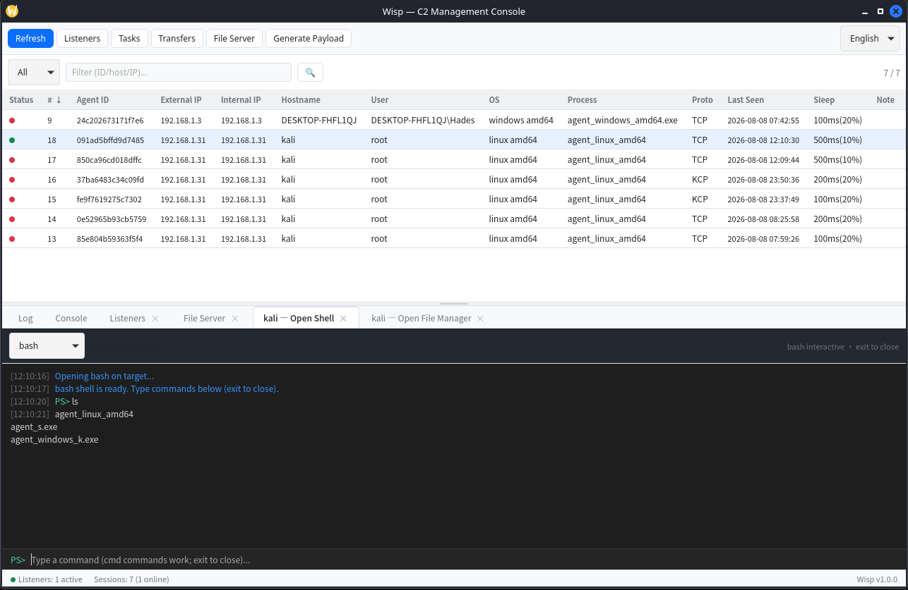
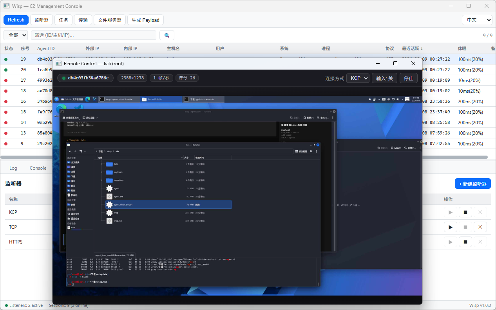
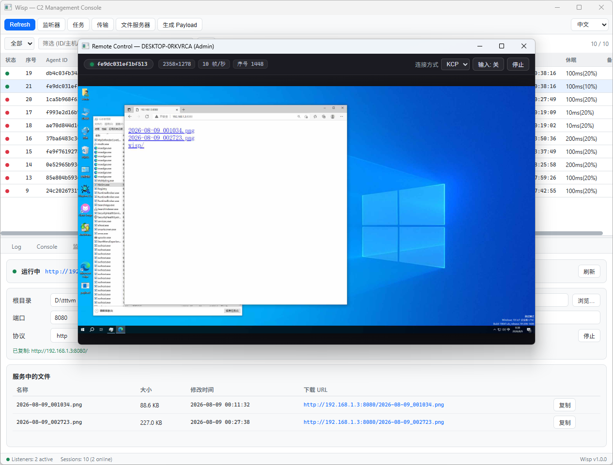
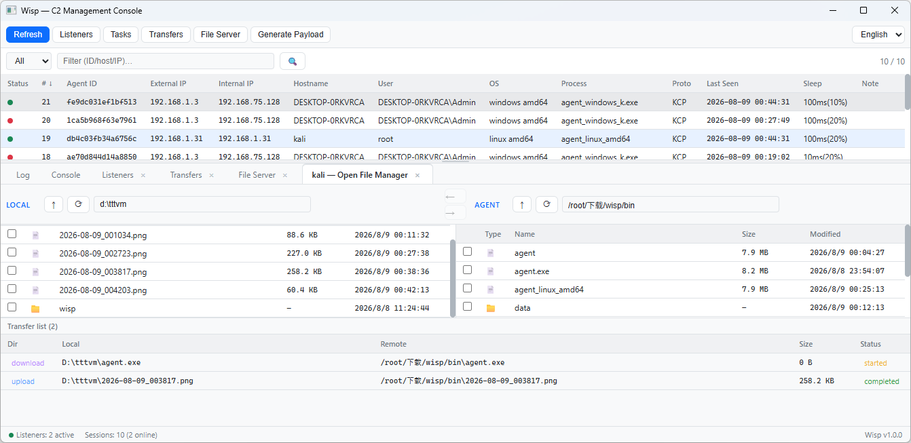
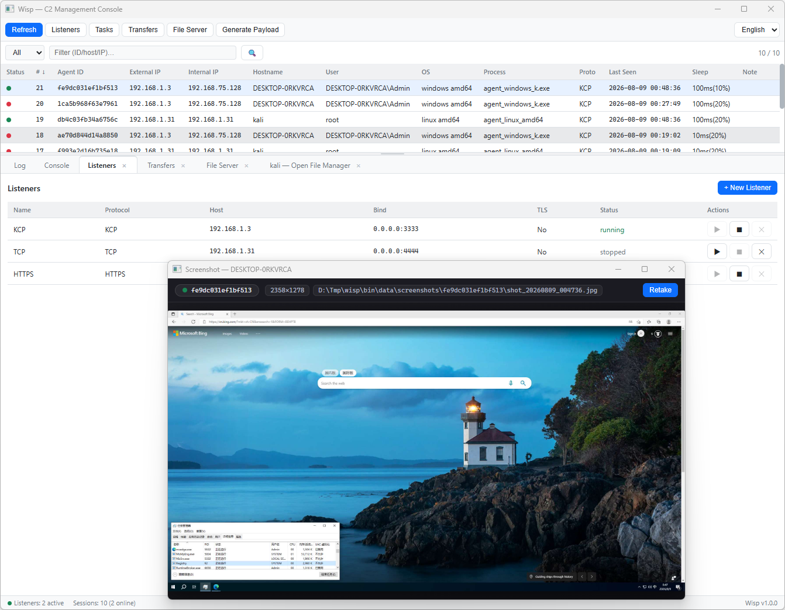

# RAT-WISP

Wisp 是一个跨平台 C2 管理控制台（也可作为远程管理工具Remote Administration Tool使用），基于 Go + Wails v3 + React + TypeScript 构建。支持多协议监听、Agent 远程管理、远程桌面、文件管理等功能。

## 截图











## 主要功能

- 多协议监听器（TCP / HTTP / HTTPS / KCP）
- 远程 Shell 与交互式 Shell
- 远程桌面（RDP）+ 独立 RCP 低延迟通道
- 文件管理（浏览、上传、下载）
- Payload 一键生成（支持 DLL 模式）
- PSK 认证、TLS 证书固定
- RSA + AES-GCM 混合加密通信

## 技术栈

| 层级 | 技术 |
|------|------|
| 桌面框架 | Wails v3 |
| 后端 | Go 1.25 |
| 前端 | React 19 + TypeScript + Vite |
| 状态管理 | Zustand |
| 数据库 | SQLite3 |

## 快速开始

**环境要求**：Go 1.25+、Node.js 18+

```bash
cd src

# 安装依赖
cd frontend && npm install && cd ..
go mod tidy

# 开发模式
wails3 dev

# 构建（Linux/macOS 用 make，Windows 用 build.bat）
make build-app          # 或 build.bat server
make agent              # 或 build.bat agent
make agent-all          # 或 build.bat agent-all
```

## 文档

- [English README](docs/README_EN.md)

## 免责声明

本工具仅供安全研究和授权测试使用。
